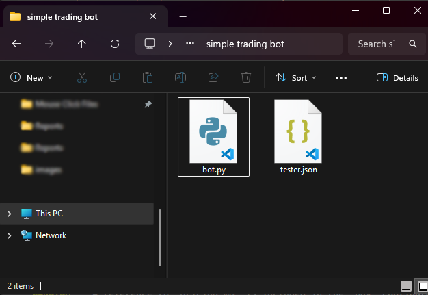

## What is StrategyTester5?

The Full documentation is found here: [strategytester5.com](strategytester5.com)

StrategyTester5 (ST5) is a Python framework for building, testing, and optimizing algorithmic trading strategies using the MetaTrader 5 platform.

It extends the native [MetaTrader 5 Python API](https://pypi.org/project/metatrader5/) by adding high-performance backtesting, simulation, and data handling capabilities that are not available out of the box.


<!--  -->

## Why StrategyTester5?

The official MetaTrader5 Python API provides access to market data and trading operations — but it lacks a built-in way to efficiently backtest and simulate trading strategies.

StrategyTester5 fills this gap by providing:

- ⚡ Fast historical data streaming (ticks & bars)
- 🧠 MetaTrader5 trade simulation engine
- 🔄 Multi-symbol backtesting support
- 📊 Strategy testing workflows similar to MT5 Strategy Tester
- 🧩 Seamless integration with the native MetaTrader5 API

<br>

Instead of building your own testing infrastructure from scratch, ST5 gives you a complete environment to develop and validate trading systems in Python.

> Built for developers who want full control over their trading logic without leaving the MetaTrader 5 ecosystem.

## How it Works

It works by mimicking a similar trading environment to that of the MetaTrader5 terminal, it then simulates that trading environment against actual ticks and bars history from the terminal.

## 🚀 Free vs Premium

| Feature | Free | Premium |
|--------|------|---------|
| High-precision backtesting | ✅ | ✅ |
| Backtesting speed | Fast | ⚡ Ultra-fast |
| Multi-symbol & multi-timeframe strategies | ✅ | ✅ |
| Visual mode (MetaTrader5 simulation) | ❌ | ✅ |
| Strategy optimization | ❌ | ✅ |
| Advanced logging & debugging | ❌ | ✅ |
| Priority support | ❌ | ✅ |

[Get your premium copy today!](https://omegajoctan.gumroad.com/l/strategytester5-pro)

# Quick Start | Build & Test your First Trading Robot

Every trading robot project needs atleast two files. The main Python file and a JSON configuration file.



These files can be named anything but it a good practice to use bot for the main trading robot and tester.json for the configuration file as it contains the so-called *tester configurations*.

## Tester Configurations

```json title="tester.json"
{
    "tester": {
        "bot_name": "Simple Trading Robot",
        "symbols": ["USDJPY"],
        "timeframe": "H1",
        "start_date": "01.01.2026 00:00",
        "end_date": "27.03.2026 00:00",
        "modelling" : "1 minute OHLC",
        "deposit": 1000,
        "leverage": "1:100"
    }
}
```

These configurations resemble those needed to backtest a trading robot in MetaTrader5 GUI.


## Nescessary Imports

Inside the main Python script (trading robot), you start by importing all necessary modules

```python title="bot.py"
import logging
import os
import sys

ROOT = os.path.abspath(os.path.join(os.path.dirname(__file__), "..", ".."))
sys.path.insert(0, ROOT)  # insert(0) so it wins over other paths

from strategytester5.tester import StrategyTester
import MetaTrader5 as mt5
from strategytester5.trade_classes.Trade import CTrade
import json
```

## Importing JSON configurations (Optional)

Instead of importing tester configurations from a JSON file, you could have a dictionary with the right keys and values.

In this case, we have configurations from a JSON file in the same directory (folder) as the main script *bot.py* so, let's import those.

```python title="bot.py"
# Get path to the folder where this script lives
BASE_DIR = os.path.dirname(os.path.abspath(__file__))

try:
    with open(os.path.join(BASE_DIR, "tester.json"), 'r', encoding='utf-8') as file: # reading a JSON file
        # Deserialize the file data into a Python object
        tester_configs = json.load(file)
except Exception as e:
    raise RuntimeError(e)
```

## Initializing MetaTrader5

Despite the strategy tester simulating the MetaTrader5 terminal, it still relies of the platform for crucial information from instruments (symbols) and a broker's account.

So, we have to initialize the MetaTrader5 terminal using it's native API as we'll need it later.

```python title="bot.py"
if not mt5.initialize():
    raise RuntimeError("Failed to initialize mt5.")
```

## StrategyTester Initialization

```python

tester = StrategyTester(tester_config=tester_configs["tester"], mt5_instance=mt5, logging_level=logging.DEBUG)
```

We also initialize the class CTrade (a submodule for easy and effective ways to manage trades)

```python title="bot.py"
# ---------------------- variables/optional ----------------------------

symbol = "USDJPY" # it should be one among the symbols in symbols list from tester.json (config file/dictionary)
timeframe = "PERIOD_H1"
magic_number = 10012026
slippage = 100
sl = 700
tp = 500

# ---------------------------------------------------------

m_trade = CTrade(terminal=tester.simulated_mt5, magic_number=magic_number, filling_type_symbol=symbol, deviation_points=slippage, logger=tester.logger)
```

## Trading Strategy

```python title="bot.py"
def pos_exists(magic: int, type: int) -> bool:
    
    """Check if position exists"""

    positions_found = tester.simulated_mt5.positions_get()
    for position in positions_found:
        if position.type == type and position.magic == magic:
            return True

    return False

symbol_info = tester.simulated_mt5.symbol_info(symbol=symbol)

def on_tick():
    
    """The main function that gets called upon the receival of new tick(s)"""

    tick_info = tester.simulated_mt5.symbol_info_tick(symbol=symbol)
    if tick_info is None:
        return

    ask = tick_info.ask
    bid = tick_info.bid
    
    pts = symbol_info.point

    if not pos_exists(magic=magic_number, type=mt5.POSITION_TYPE_BUY):  # If a position of such kind doesn't exist
        m_trade.buy(volume=0.01, symbol=symbol, price=ask, sl=ask - sl * pts, tp=ask + tp * pts, comment="Tester buy")  # we open a buy position

    if not pos_exists(magic=magic_number, type=mt5.POSITION_TYPE_SELL):  # If a position of such kind doesn't exist
        m_trade.sell(volume=0.01, symbol=symbol, price=bid, sl=bid + sl * pts, tp=bid - tp * pts, comment="Tester sell")  # we open a sell position
```

## Running the Backtest

All it takes is one function call.

```python
tester.run(on_tick_function=on_tick) # very important!
```