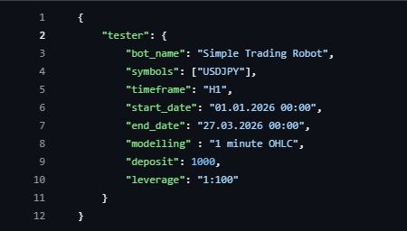

The StrategyTester5 framework has the same syntax as the MetaTrader5 API, thanks to the [Simulated MetaTrader5 API](../api/metatrader5/api.md) with a few tweaks you can get your Python code for the MetaTrader5 up and running through a specified time in the past just like testing a Native trading robot made in the MetaTrader5 terminal.

Below are a few things to consider:

## Rules of Thumb

### Firstly, Initialize the MetaTrader5 terminal 

After importing the right modules you must initialize the terminal using the [MetaTrader5 Native API](https://www.mql5.com/en/docs/python_metatrader5) before everything else.

The initialized MetaTrader5 instance helps the simulated MetaTrader5 within a StrategyTester instance mimick the platform by extracting crucial platform and broker-specific details such as account information, instruments (symbols) and their configurations, charts settings, etc.

### MetaTrader5-Like StrategyTester Configurations

The StrategyTester class expects tester configurations in the form of a dictionary:
```py
def __init__(self,
                tester_config: dict,
                mt5_instance: Any,
                logging_level: int = logging.WARNING,
                logs_dir: Optional[str] = "Logs",
                reports_dir: Optional[str] = "Reports",
                history_dir: Optional[str] = "History",
                trading_history_dir: Optional[str] = "TradingHistory",
                polars_collect_engine: Literal["auto", "in-memory", "streaming", "gpu"] = "auto"):
```
> Rule of thumb, always import configurations from a JSON file—it makes it easier to manage.

As it stands currently, supported keys in a configuration dictionary include:

| Key        | Description |
|------------|------------|
| bot_name   | The name of a trading robot you are working on, this name will be used for logging and in naming backtesting reports |
| symbols    | A list of instruments that are expected to be used in the project. **No surprises allowed — **all symbols must be defined here before deployment**|
| timeframe  | The main timeframe you want to use. This doesn't affect trading outcome, but it is mostly used for fetching bars and tells the simulator how often to record balance, equity, and other crucial information during simulation |
| start_date | The starting date to start backtesting |
| end_date   | The ending date for backtesting |
| modelling  | The type of modelling to use. Suppored: `1 minute OHLC`, `Open price only`, and `Every tick based on real ticks` |
| deposit    | Initial account balance for the backtesting |
| leverage   | [Leverage](https://www.ig.com/en/risk-management/what-is-leverage) to use for the simulated account |
| visual_mode| **Premium only**. Enables visualization in the StrategyTester terminal.| 

Example **config.json**



### Always, use the simulated MetaTrader5 extracted from the StrategyTester

After instantiating the strategytester class, you should extract the simulated MetaTrader5 from it.

```py
tester = StrategyTester(tester_config=tester_config, mt5_instance=mt5, logging_level=logging.DEBUG)
sim_mt5 = tester.simulated_mt5 # extract the simulated metatrader5 from the StrategyTester object and assign it to a simple variable
```

You should replace all methods accessing the [native MetaTrader5 API](https://www.mql5.com/en/docs/python_metatrader5) attribute with this simulated instance, in your existing logic relying on the native API.

!!! Note "Additionally"

    Instead of logging using the builtin print function, we recommend you use the logger extracted from the strategy tester.
    ```py
    logger = tester.logger # extract a logger
    ```
    This provides detailed logs aware of the simulated time. For more information see: [Logging and debugging](../documentation/logging_debugging.md)

### All Trading Logic Should be Organized in a Single Function

The StrategyTester main function for backtesting is called `run`, it expects a single (standalone) function with all the trading logic and everything traced to it. 

This function is the one repeatedly called throughout history.

We recommend this function to be called on_tick but the naming isn't important as what it holds

### The run Method

This is the final function that runs backtesting and handles everything including exporting trading history, reports, etc.

It expects the main strategy function, and returns the TesterStats object with all the statistics used in the final report.

```py
def run(self, on_tick_function: Any) -> stats.TesterStats:
```