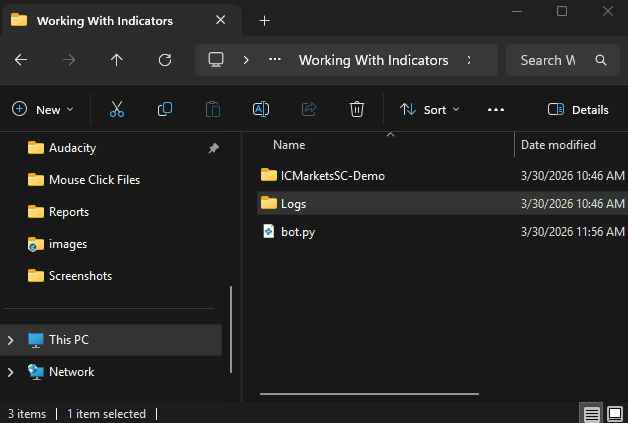

## Internal Logging

Its normal for a program or software to contain bugs so we need a simple yet efficient way to monitor log records for efficient debugging.

ST5 has a builtin logging system that uses simulated time extracted from ticks and bars which can help navigate through history and identify where issues are arising or the logic is backfiring.

With the help of [logging levels](https://docs.python.org/3/howto/logging.html) we can choose how much and deep we want to record and monitor the behaviour of our program.

## External Logging | Your rules

For external logging in your scripts you can extract the logger fron the instantiated StrategyTester instance

```py
tester = StrategyTester(tester_config=tester_config, mt5_instance=mt5, logging_level=logging.DEBUG)
sim_mt5 = tester.simulated_mt5 # extract the simulated metatrader5 from the StrategyTester object and assign it to a simple variable
logger = tester.logger # extract the logger
```

And use it as you see fit.

For example:
```py

def on_tick():
    #...
    #...

    indicator_value = 100
    logger.info(f"Current indicator value : {indicator_value}")

```

All logs will be stored in a subfolder called Logs in the same folder as the main script.



> The final .log file is written in Year:Month:Date format, using the current local time for the naming

## A Regular Print

While not recommended but, you can still print and record whatever is it that you want, but we recommend keeping track of time using the method [current_time()](../api/metatrader5/api.md) offered by the simulated MetaTrader5. It gives you the current time in seconds during the simulation. Helping you print with time awareness.


For example:
```py
def on_tick():
    #...
    #...

    indicator_value = 100
    logger.info(f"time_sec: {sim_mt5.current_time()} Current indicator value : {indicator_value}")
```
