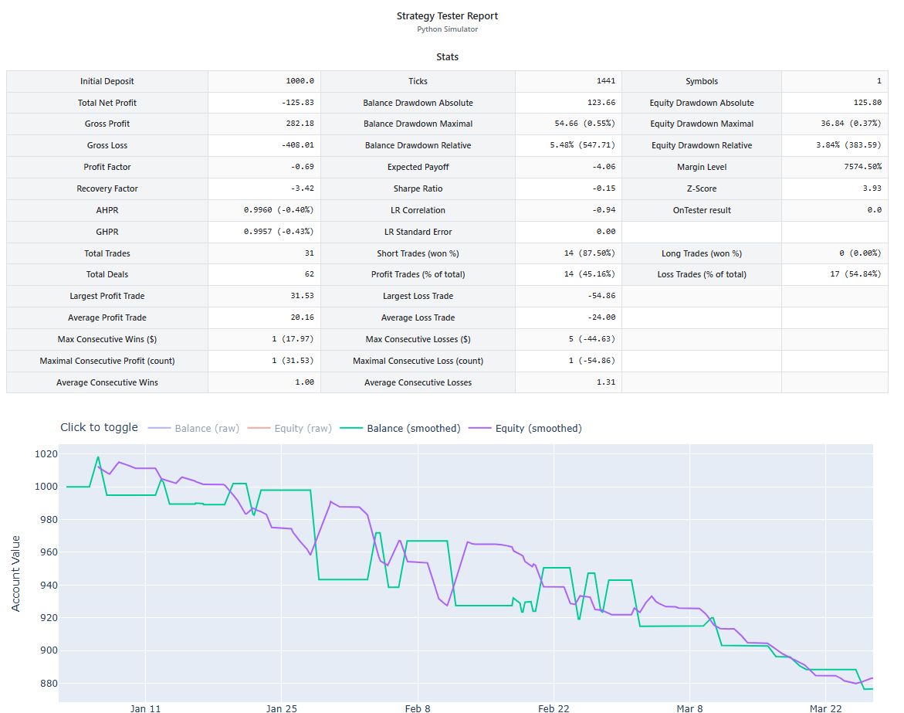

## Imports

The first thing we do is, import all the necessary modules
```py title="bot.py"
import logging
from strategytester5.tester import StrategyTester
from strategytester5.trade_classes.Trade import CTrade
import MetaTrader5 as mt5
import pandas as pd
from ta.momentum import rsi

```
!!! Note "Note"
    From momentum submodule we import a method called rsi which calculates the indicator.
    ```py
    from ta.momentum import rsi
    ```

## MetaTrader5 Initialization


!!! Note "Note"

    Despite the strategy tester simulating the MetaTrader5 terminal, it still relies of the platform for crucial information from instruments (symbols) and a broker's account.

    **This is a crucial step that shouldn't be missed.**

```py
if not mt5.initialize():
    raise RuntimeError("Failed to initialize mt5.")
```

## StrategyTester Configurations

This time we use a dictionary within a script rather than a JSON file:

```py
tester_config = {
        "bot_name": "RSI Strategy Bot",
        "symbols": ["EURUSD"],
        "timeframe": "H1",
        "start_date": "01.01.2026 00:00",
        "end_date": "27.03.2026 00:00",
        "modelling" : "Open price only",
        "deposit": 1000,
        "leverage": "1:100"
}
```

## StrategyTester Initialization

```py
tester = StrategyTester(tester_config=tester_config, mt5_instance=mt5, logging_level=logging.DEBUG)
sim_mt5 = tester.simulated_mt5 # extract the simulated metatrader5 from the StrategyTester object and assign it to a simple variable
logger = tester.logger # extract a logger
```

## Optional | Global variables and the CTrade helper

```py
symbol  = tester_config["symbols"][0] # should be one among the symbols in symbols list from tester.json (config file/dictionary)
timeframe = sim_mt5.TIMEFRAME_H1 # This should be an integer so you should convert timeframe in string into integer

# ---------------------------------------------------------

MAGIC_NUMBER = 1001
m_trade = CTrade(terminal=sim_mt5, magic_number=MAGIC_NUMBER, filling_type_symbol=symbol, deviation_points=100, logger=tester.logger)
```

## RSI Reversal Strategy

The strategy is simple; We open a long trade when the price reaches the oversold threshold and do the opposite when the price reaches an overbought threshold, we open a short trade.

The common thresholds are usually 30.0 and 70.0 for oversold and overbought respectively. *In other words, these are short and sold signals respectively.*

When a long signal is receved we close short trades and when a short signal is received we do the same but, oppposite, close a long trade.

Not to mention, we open a single trade (position) in one direction at a time.

```py title="bot.py"
def pos_exists(magic: int, pos_type: int) -> bool:
    """Check if position exists"""
    positions_found = sim_mt5.positions_get()
    for position in positions_found:
        if position.type == pos_type and position.magic == magic:
            return True

    return False

def close_pos_by_type(magic: int, pos_type: int):
    """Close positions by type"""
    positions_found = sim_mt5.positions_get()
    for position in positions_found:
        if position.type == pos_type and position.magic == magic:
            m_trade.position_close(position.ticket)

def on_tick():

    indicator_window = 14
    rates = sim_mt5.copy_rates_from_pos(symbol=symbol, timeframe=timeframe, start_pos=0, count=indicator_window)

    if rates is None or len(rates) < indicator_window: # if no information was found, or less than expected rates were returned
        return # prevent further calculations

    rates_df = pd.DataFrame(data=rates)
    rsi_value = rsi(close=rates_df["close"], window=indicator_window).iloc[-1]

    # rsi strategy

    rsi_oversold = 30.0
    rsi_overbought = 70.0

    symbol_info = sim_mt5.symbol_info(symbol=symbol)
    lot_size = symbol_info.volume_min


    if rsi_value < rsi_oversold: # long signal
        if not pos_exists(magic=MAGIC_NUMBER, pos_type=sim_mt5.POSITION_TYPE_BUY):
            m_trade.buy(volume=lot_size, symbol=symbol, price=symbol_info.ask)

        close_pos_by_type(magic=MAGIC_NUMBER, pos_type=sim_mt5.POSITION_TYPE_SELL)

    if rsi_value > rsi_overbought: # short signal
        if not pos_exists(magic=MAGIC_NUMBER, pos_type=sim_mt5.POSITION_TYPE_SELL):
            m_trade.sell(volume=lot_size, symbol=symbol, price=symbol_info.bid)

        close_pos_by_type(magic=MAGIC_NUMBER, pos_type=sim_mt5.POSITION_TYPE_BUY)
```

## Backtesting

```py
tester.run(on_tick_function=on_tick) 
```

At the end of the backtest you should see a strategy tester report. 

Under Reports subfolder:


