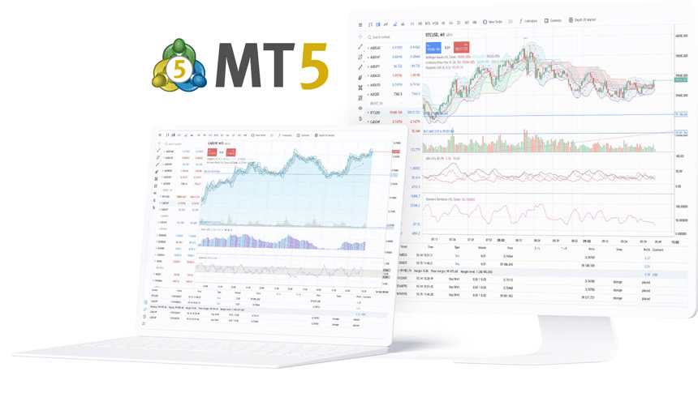

---
hide:
    - navigation

---
## What is StrategyTester5?

StrategyTester5 (ST5) is a Python framework for building, testing, and optimizing algorithmic trading strategies using the MetaTrader 5 platform.

It extends the native [MetaTrader 5 Python API](https://pypi.org/project/metatrader5/) by adding high-performance backtesting, simulation, and data handling capabilities that are not available out of the box.

<!--  -->

## Why StrategyTester5?

The official MetaTrader5 Python API provides access to market data and trading operations — but it lacks a built-in way to efficiently backtest and simulate trading strategies.

StrategyTester5 fills this gap by providing:

- ⚡ Fast historical data streaming (ticks & bars)
- 🧠 MetaTrader5 trade simulation engine
- 🔄 Multi-symbol backtesting support
- 📊 Strategy testing workflows similar to MT5 Strategy Tester
- 🧩 Seamless integration with the native MetaTrader5 API

 

Instead of building your own testing infrastructure from scratch, ST5 gives you a complete environment to develop and validate trading systems in Python.

> Built for developers who want full control over their trading logic without leaving the MetaTrader 5 ecosystem.

## How it Works

It works by mimicking a similar trading environment to that of the MetaTrader5 terminal, it then simulates that trading environment against actual ticks and bars history from the terminal.

## 🚀 Free vs Premium

| Feature | Free | Premium |
|--------|------|---------|
| High-precision backtesting | ✅ | ✅ |
| Backtesting speed | Fast | ⚡ Ultra-fast |
| Multi-symbol & multi-timeframe strategies | ✅ | ✅ |
| Visual mode (MetaTrader5 simulation) | ❌ | ✅ |
| Strategy optimization | ❌ | ✅ |
| Advanced logging & debugging | ❌ | ✅ |
| Priority support | ❌ | ✅ |

[Get your premium copy today!](https://omegajoctan.gumroad.com/l/strategytester5-pro)